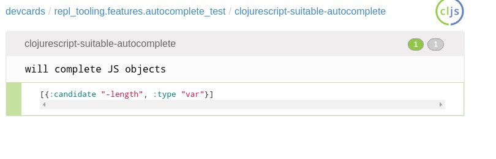
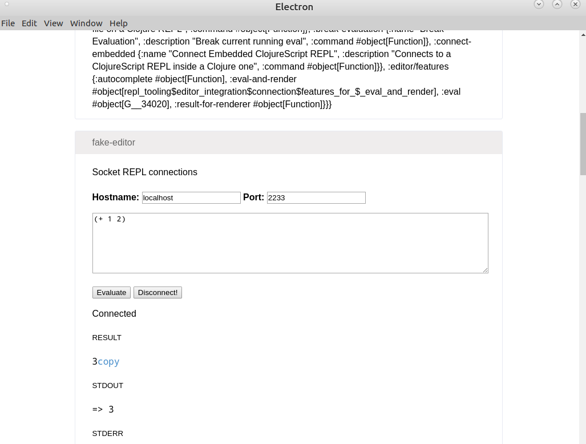

# Clojure REPL's Tooling

[](https://circleci.com/gh/mauricioszabo/repl-tooling)

This library's idea is to work as a base package for Clojure's editor tooling. The idea is to work in multiple environments, it is written in ClojureScript so it'll work with Atom, VS Code, NeoVIM, and other editors that are able to run JS.

## Design decisions
This library is not made to be stand-alone, but to work as base for editor plug-ins (or web interfaces, etc). This means that there is no "main entry point" - there's only one entry on `shadow-cljs.edn` file to run tests.

This lib is, right now, being developed together with Atom Chlorine. The best way to experiment with it right now is to add a submodule on your project and ask for Shadow-CLJS to add `repl-tooling/src` (or whatever the path you configured for your submodule) as a source-path. It would be great if we didn't add too many dependencies for it to work, as probably specific editor's will pull their dependencies and they may conflict with this lib's deps (and also because of security issues).

This lib depends on `lein` just to publish the code to clojars. It is not clear how different editors will handle paths, so to sideload files (like, for example, the `unrepl` blob) I'm using the `resources` folder, and generating a macro. This means that when we compile a release version, the contents of the files will be inlined on the end code.

Also, there can't be specific editor's code inside repl-tooling. We can't priorize one editor from another, exactly because we need to find common ground between all editors. This have the huge advantage that, when we add a feature on repl-tooling, all editor's plug-ins will automatically have that new feature. Also, when we fix a bug, all editor's plug-ins will have the bug fixed.

## Developing a new feature / bug fixes
To be able to integrate better with all editors, REPL-Tooling doesn't use any specific editor commands. So, to be able to develop/test code, we need some environment to run.

Currently, it uses Electron. So, if you found a bug and want to fix it, or if you want to develop a new feature, it's better to use Electron simply because it allows for fine-tuned control over what's happening, which REPL is connected, and also it eases tests. So, after you've cloned the repository, you have to run the following commands:

```
npm install # Will install node dependencies
./scripts/watch # Will compile the app, and run a simple CLJS node script
npm start # Will start Electron so you can test things
```

This project uses devcards to make the tests. They can be as simple as a `deftest` with assertions:


To a full, almost-editor-like experience, that is able to connect to arbitrary REPLs and evaluate code, and it'll assert over something rendered on the view to be sure everything is working fine:


## Plans for the future / documentation
All editors share a common ground: they need to evaluate code. When they can do it, we can use Compliment's autocomplete, external libraries, refactor-nrepl, cider, and other tools. So, the editor will need to ask this library for some informations.

This plug-in will also need to work around UNREPL. Unrepl is great to use, but sometimes it can be tricky: for example, when we have a big exception like `ex-info`, it'll not show `:cause` or `:trace` keys. This means that we'll need to lazy-fetch these infos until they are present

# A semi-organized TODO

* [x] UNREPL client (for Clojure's REPLs)
* [x] Socket REPL client for Clojure
* [x] Socket REPL client for self-hosted ClojureScript
* [x] Socket REPL client for Lumo
* [x] AutoComplete detector (Lumo, Clojure, ClojureScript)
* [x] Detect beginning and ending of forms (for editor to evaluate)
* [x] Detect NS of current file
* [ ] Detect features for refactoring, refresh, auto-import, organize namespace, and others

It is important that notice that this library needs to distinguish between output and result of commands - if not possible, result of commands should be priorized uniquely because it's essential for detection of features, autocompletes, and interaction with external libraries.
